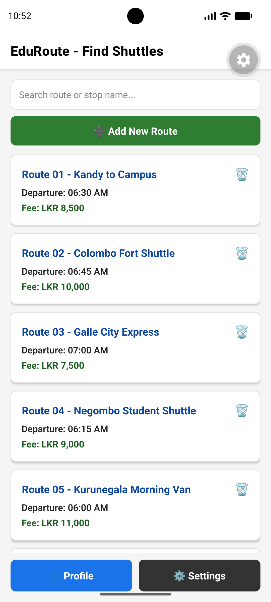
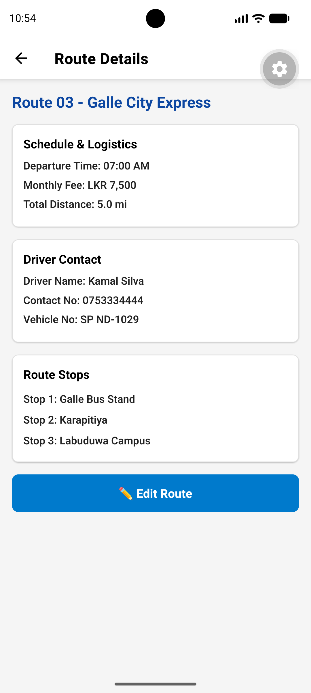

# 🚌 EduRoute – Student Shuttle & Route Finder App

**EduRoute** is a React Native mobile application developed to help university students easily find and manage student shuttle route information.

The application allows students to search for available shuttle routes and view important information such as departure times, stops, distance, monthly fees, vehicle numbers, and driver contact details.

This project is the **Sprint 2 – Feature-Complete App** developed for the **CSI2114 – Mobile Application Development** module.

---

##  Project Information

| Item          | Details                                  |
| ------------- | ---------------------------------------- |
| Project Name  | EduRoute                                 |
| Sprint        | Sprint 2 – Feature-Complete App          |
| Module        | CSI2114 – Mobile Application Development |
| Technology    | React Native                             |
| Framework     | Expo                                     |
| Backend       | MockAPI                                  |
| Local Storage | AsyncStorage                             |
| Navigation    | React Navigation                         |
| Language      | JavaScript                               |
| Platform      | Android                                  |

---

##  Project Objectives

The main objectives of EduRoute Sprint 2 are:

* Provide an easy way for students to find shuttle routes.
* Integrate a REST API using MockAPI.
* Implement CRUD operations for shuttle routes.
* Store selected application data locally using AsyncStorage.
* Provide search and filtering functionality.
* Display detailed information about shuttle routes.
* Provide student profile management.
* Implement application settings and theme preferences.
* Handle loading, empty, and error states.
* Demonstrate a complete working React Native application.

---

# ✨ Features

##  Home Screen

The Home Screen provides students with an overview of available shuttle routes.

Features include:

* Display shuttle routes using `FlatList`
* Search routes by route name
* Search routes by stop name
* Display route information
* Navigate to the Route Details screen
* Load route data from the REST API

---

##  Route Search

Students can search for available routes using the search bar.

The search functionality allows filtering based on:

* Route name
* Stop names

The results are displayed dynamically using React Native's `FlatList`.

---

##  Route Details

The Route Details screen displays detailed information about a selected shuttle route.

Information includes:

* Route name
* Departure times
* Route stops
* Total distance
* Monthly fee
* Vehicle number
* Driver contact details

---

# 🌐 REST API Integration – MockAPI

EduRoute Sprint 2 uses **MockAPI** as the REST API backend for managing shuttle route data.

The application is connected to a MockAPI `routes` resource.

### MockAPI Endpoint

```text
https://6a8d3963baf2ac84246cd751.mockapi.io/api/v1/routes
```

API implementation is located in:

```text
services/api.js
```

## API Operations

The application implements the following REST API operations:

### GET – Fetch Routes

Retrieves shuttle route data from MockAPI.

```javascript
fetchRoutes()
```

### POST – Add Route

Creates a new shuttle route in the MockAPI resource.

```javascript
addRoute(newRoute)
```

### PUT – Update Route

Updates an existing shuttle route using its ID.

```javascript
updateRoute(id, updatedRoute)
```

### DELETE – Delete Route

Deletes an existing shuttle route using its ID.

```javascript
deleteRoute(id)
```

Therefore, the application implements:

* ✅ GET
* ✅ POST
* ✅ PUT
* ✅ DELETE

The API service also includes error handling using `try/catch` blocks and HTTP response status validation.

---

#  CRUD Functionality

EduRoute implements CRUD functionality for shuttle routes.

| Operation | Function        | Purpose                  |
| --------- | --------------- | ------------------------ |
| Create    | `addRoute()`    | Add a new shuttle route  |
| Read      | `fetchRoutes()` | Retrieve shuttle routes  |
| Update    | `updateRoute()` | Modify an existing route |
| Delete    | `deleteRoute()` | Remove a route           |

This allows the application to manage shuttle route data through the MockAPI backend.

---

#  Local Data Persistence

EduRoute uses **AsyncStorage** to persist selected application data locally on the device.

AsyncStorage is used to retain user/application preferences even after the application is closed and reopened.

Local persistence is used for features such as:

* Student profile information
* Application settings
* Distance unit preference
* Theme preference
* Shuttle arrival alert preference

The application retrieves stored information when required and updates the stored values when the user changes their preferences.

---

#  Settings

The Settings screen provides users with options to customize the application.

Available settings include:

###  Distance Unit

Users can switch between:

* Kilometers (km)
* Miles (mi)

###  Theme

Users can switch between:

* Light Mode
* Dark Mode

###  Shuttle Arrival Alerts

Users can enable or disable shuttle arrival notifications/alerts.

Settings are managed using the **React Context API** and persisted using **AsyncStorage**.

---

#  Context API

EduRoute uses React Context API for centralized application settings management.

The context file is:

```text
context/SettingsContext.js
```

The `SettingsContext` manages shared settings such as:

* Distance unit
* Theme
* Shuttle alerts
* Persistent settings

This avoids unnecessary prop drilling between multiple screens.

---

#  Student Profile

The Student Profile screen allows users to manage their profile information.

Features include:

* Student profile information
* Edit profile
* Gender selection
* Dynamic avatar
* Profile theme changes
* Digital bus pass
* Quick statistics

---

#  Digital Bus Pass

The application provides a digital bus pass section for students.

The pass can display relevant student information and can be used as a digital representation of the student's shuttle pass.

---

#  Dynamic Profile Customization

The profile screen provides gender selection buttons.

The selected gender changes the profile avatar and visual appearance.

Example profile themes include:

* Male profile
* Female profile

The profile UI updates dynamically based on the selected option.

---

#  Loading, Empty & Error States

The application includes appropriate handling for different API states.

### Loading State

A loading indicator is displayed while route data is being retrieved from the API.

### Empty State

If no routes are available or no routes match the search criteria, an appropriate empty-state message is displayed.

### Error State

If an API request fails, the application handles the error and provides appropriate feedback to the user.

API errors are handled in the API service using:

```javascript
try {
  // API request
} catch (error) {
  // Error handling
}
```

HTTP response status is also checked using:

```javascript
if (!response.ok) {
  throw new Error(...);
}
```

---

#  Navigation

EduRoute uses **React Navigation** to move between application screens.

Main screens include:

* Home Screen
* Route Details Screen
* Settings Screen
* Student Profile Screen

Navigation allows users to move between screens easily and return to previous screens when required.

---

# 🗂️ Project Structure

```EDUROUTE/
│
├── assets/
│   └── screenshots/
│       ├── home.png
│       ├── detail.png
│       ├── settings.png
│       ├── profile.png
│       └── qrcode.png
│
├── context/
│   └── SettingsContext.js
│
├── data/
│   └── routesData.js
│
├── screens/
│   ├── HomeScreen.js
│   ├── DetailScreen.js
│   ├── SettingsScreen.js
│   ├── ProfileScreen.js
│   ├── AddRouteScreen.js
│   └── EditRouteScreen.js
│
├── src/
│   └── services/
│       └── api.js
│
├── scripts/
│   └── reset-project.js
│
├── android/
│
├── .vscode/
│
├── .gitignore
├── App.js
├── app.json
├── eas.json
├── package.json
├── package-lock.json
├── README.md
└── tsconfig.json
```

---

#  Main Files and Folders

### `App.js`

Main entry point of the React Native application.

Responsible for:

* Application initialization
* Navigation setup
* Context provider integration

### `screens/`

Contains the main application screens.

* `HomeScreen.js` – Displays and searches shuttle routes.
* `DetailScreen.js` – Displays detailed route information.
* `SettingsScreen.js` – Manages application settings.
* `ProfileScreen.js` – Displays and manages student profile information.

### `services/api.js`

Contains all REST API functions used to communicate with MockAPI.

Implemented operations:

* GET
* POST
* PUT
* DELETE

### `context/SettingsContext.js`

Manages shared application settings using React Context API.

### `data/routesData.js`

Contains route-related data used by the application where applicable.

### `assets/screenshots/`

Contains screenshots used to document the application interface.

---

#  Application Screenshots

## Home Screen



The Home Screen displays available shuttle routes and provides route search functionality.

---

## Route Details



The Route Details screen displays complete information about a selected shuttle route.

---

## Settings


The Settings screen allows users to manage application preferences.

---

## Student Profile


The Profile screen provides student profile information, customization options, and digital bus pass functionality.

---

## QR Code / Digital Bus Pass


The application includes a digital bus pass / QR code feature for students.

---

#  Technologies Used

### Frontend

* React Native
* Expo
* JavaScript
* React Hooks
* React Navigation
* FlatList

### Backend / API

* MockAPI
* REST API
* Fetch API

### Local Storage

* AsyncStorage

### State Management

* React `useState`
* React Context API

### Development Tools

* Visual Studio Code
* Node.js
* npm
* Expo CLI
* Android

---

#  Installation

## 1. Clone the Repository

Clone the Sprint 2 repository from GitHub.

```bash
git clone https://github.com/susindusaksew/EduRoute-Sprint-2.git
```

Navigate into the project:

```bash
cd EduRoute-Sprint-2
```

---

## 2. Install Dependencies

Run:

```bash
npm install
```

---

## 3. Start the Expo Development Server

Run:

```bash
npx expo start
```

After starting Expo, the application can be opened using:

* Expo Go
* Android Emulator
* Android device

---

#  Android Build

An Android APK can be generated using Expo/EAS build tools.

Example:

```bash
eas build --platform android
```

The generated APK can be used for the Sprint 2 submission and demonstration.

---

# Sprint Repositories

EduRoute was developed across two sprint repositories.

### Sprint 1

**EduRoute – Sprint 1 Prototype**

```text
https://github.com/susindusaksew/EduRoute
```

Sprint 1 focused on:

* Navigation
* Lists
* Basic state management
* Route search
* Route details
* Initial application prototype

### Sprint 2

**EduRoute – Sprint 2 Feature-Complete App**

```text
https://github.com/susindusaksew/EduRoute-Sprint-2
```

Sprint 2 extends the application with:

* REST API integration
* MockAPI
* CRUD operations
* AsyncStorage
* Context API
* Error handling
* Loading states
* Empty states
* Enhanced profile and settings features

---

# 🧪 Sprint 2 Requirements

The Sprint 2 application addresses the required assessment features.

| Requirement         | Implementation            |
| ------------------- | ------------------------- |
| REST API            | MockAPI                   |
| GET                 | Fetch shuttle routes      |
| POST                | Add shuttle route         |
| PUT                 | Update shuttle route      |
| DELETE              | Delete shuttle route      |
| Local Storage       | AsyncStorage              |
| State Management    | React Hooks + Context API |
| Loading State       | Implemented               |
| Error Handling      | Implemented               |
| Empty State         | Implemented               |
| Navigation          | React Navigation          |
| Working Android App | Expo / Android            |

---

#  Future Improvements

Possible future improvements include:

* Real-time GPS shuttle tracking
* Push notifications
* Online payment integration
* Driver-side application
* Student booking system
* Route map integration
* Firebase authentication
* Real-time shuttle arrival information

---

#  Developer

**EduRoute – Student Shuttle & Route Finder App**

Developed as part of:

**CSI2114 – Mobile Application Development**

**Advanced Diploma of Computer Science**

**ACBT / Middlesex University**

---

#  License

This project was developed for educational and academic purposes as part of the CSI2114 Mobile Application Development module.
